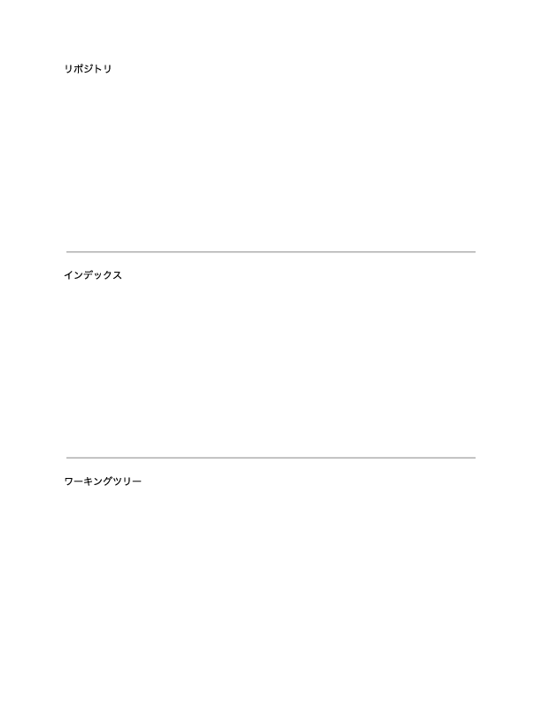
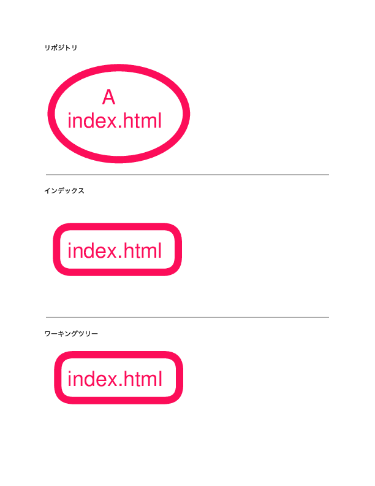
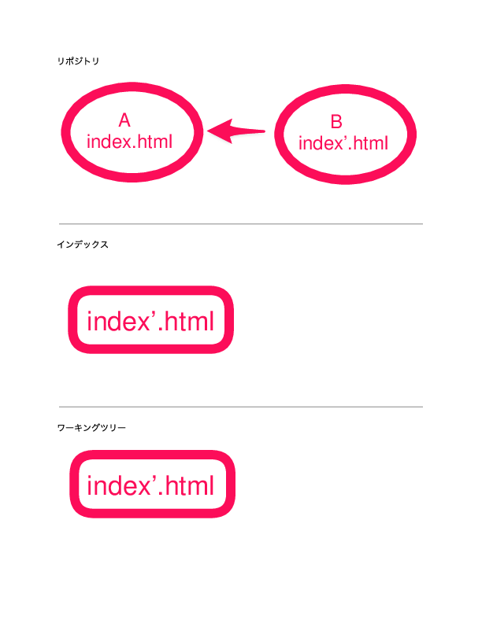

# 1時間目: Gitのメンタルモデル

## 目的: GUIユーザーからコマンドラインへの飛躍

---

## この講義で目指すこと

*   Gitの基本的な操作は知っているけれど、その「仕組み」がよく分からないと感じている皆さんへ。
*   この講義の目標は、皆さんの頭の中にあるGitのイメージを、より正確で頑丈なものに作り変えることです。
*   単にコマンドを覚えるだけでなく、Gitが内部でどのようにデータを管理し、バージョンを記録しているのか、特に「コミットオブジェクト」という考え方を深く理解することを目指します。

---

## 学習目標

*   Gitに関する一般的で有害な誤解を解き、正しい理解の土台を築く。
*   Gitの核心的アイデンティティが「スナップショットを記録する内容アドレス可能ファイルシステム」であることを確立する。
*   Gitの3つのエリア(ワーキングディレクトリ、インデックス、リポジトリ)という基本概念を導入する。
*   バージョン履歴を有向非巡回グラフ(DAG)として捉える視点を養う。

---

## このセッションで学ぶこと

*   Gitを学ぶ上でつまずきやすいのは、コマンドの難しさではなく、Gitに対する誤ったイメージを持っていることだと言われています。
*   この最初のセッションでは、コマンドライン操作は一切行いません。Gitの基本的な考え方をしっかり理解することに集中し、コンピュータを使わない「アンプラグド」な活動を通して、確かなGitのイメージを築きます。
*   これにより、今後のセッションで学ぶGitコマンドが、単なる「おまじない」ではなく、皆さんが築いたGitのモデルを実際に確認する作業へと変わっていくでしょう。

---

## 誤解の解体: 「Gitではないもの」

### Git ≠ GitHub

*   Git: ローカルマシンで動作する「エンジン(ソフトウェア)」。
*   GitHub/GitLab: Gitリポジトリをホスティングし、共同作業を支援する「ディーラー兼サービスセンター(プラットフォーム)」。
*   エンジンがあれば、ディーラーに行かなくても車は運転できる。

---

### Git ≠ 「保存」ツール

*   `Ctrl-S` (上書き保存、過去を破壊する) と `git commit` (バージョン保存、過去を構築する) を対比。
*   Gitは単にファイルを保存するのではなく、プロジェクト全体の「バージョン(スナップショット)」を保存する。

---

### Git ≠ 差分(デルタ)を管理

*   Gitは差分を表示できるが、その核心モデルはスナップショットに基づいている。
*   コミットごとに、Gitはその時点での全ファイルの状態を丸ごと記録する。
*   これは公式ドキュメント「Pro Git」でも強調されている基本概念であり、Gitの速度とパワーを理解する鍵。

---

## コアモデル: 内容アドレス可能ファイルシステム

*   Gitの心臓部は、キーバリュー型のデータストア。
*   「値」はあらゆるコンテンツ(ファイル、ディレクトリ構造)であり、「キー」はそのコンテンツのSHA-1ハッシュ値。
*   内容(content)によって一意のアドレス(key)が定まるため、「内容アドレス可能」と呼ばれる。

※ 便宜上この授業では各コミットはSHA-1ではなく

---

## コアモデル: 有向非巡回グラフ (DAG)

*   ホワイトボードに、コミットを表す円と、親コミットを指す矢印を描く。
*   これが研修全体を通じて最も重要な視覚モデルとなる。

<pre class="mermaid">
graph RL
    D((D)) --> C((C))
    C --> B((B))
    B --> A((A))
</pre>

*Gitのコミット履歴は、このように一方通行のつながりを持つグラフで表現されます。*

---

## 3つのツリー: 変更がたどる旅

*   ファイルが存在する3つのエリアを視覚的に表現。

1.  **ワーキングディレクトリ**: 皆さんが直接見て編集する、ファイルシステム上の実際のファイル群。
2.  **インデックス** (またはステージングエリア): 次のコミットに何を含めるかを記録する準備ファイル。Gitの「ネクストバッターズサークル」。
3.  **リポジトリ** (.gitディレクトリ): 全てのコミット(スナップショット)を永久に、不変的に保存するデータベース。

---

## 演習(準備): ホワイトボードGit (アンプラグド活動)

ちょっと準備をしてください。

- 紙と鉛筆(もしくはホワイトボードとマーカー)
- もしくはペン入力できるタブレット上での白紙

1. 2本の線を引く(3つの領域に分割される)
2. それぞれに名前を付ける(済にでも書き込む)
    - リポジトリ
    - インデックス
    - ワーキングディレクトリ

---

## 作成例

*図: 何もコミットされていない空のリポジトリのイメージ例。ワーキングディレクトリ、インデックス、リポジトリの3つの領域が区切られている。*

---

## 演習: ホワイトボードGit (アンプラグド活動)

*   **目的**: 3つのツリーモデルとDAGを物理的に体験する。
*   **手順**:
    1. これから私が指示を出します
    2. その指示に従って、紙上で操作を行ってください

次のページから実際に指示を出します。

---

## 演習: ホワイトボードGit (アンプラグド活動)

* あなたは `index.html` というファイルを作成しました、これはワーキングディレクトリに存在します。
  * ワーキングディレクトリに `index.html` ファイルを描いてください。
* この状態を記録したいので、インデックスに追加します。
  * インデックスに `index.html` を追加してください。
  * ワーキングディレクトリはそのままです!
* この状態をコミットします。
  * リポジトリに `index.html` を含めた"A"という名前付きの○を描いてください。
  * ワーキングディレクトリとインデックスはそのままです!

---

## こんな感じになります

---

## 演習: ホワイトボードGit (アンプラグド活動)

* あなたは `index.html` に新しい内容を追加しました。
  * ワーキングディレクトリの `index.html` を更新してください。
    (便宜上、`index.html` にダッシュを付けて `index'.html`としてください)
* このとき、インデックスとワーキングディレクトリの間はどうなっていますか?
  * インデックスにはまだ古い内容の `index.html` が残っています。
  * つまり「違う」状態とわかる
* この状態をインデックスに追加します。
  * インデックスの`index.html`を`index'.html`に更新してください
* この状態をコミットします。
  * リポジトリ領域に `index'.html` を含めた"B"という名前付きの○を描いてください。
  * BからAに矢印を引いてください

---

## こんな感じになります

---

## わかること

* 実際に私たちが作成・削除・更新しているものはワーキングディレクトリである。
* ワーキングディレクトリを変更してもインデックスは連動していない。
    * インデックスには古い状態が残っていることがある。
    * なので明示的に「インデックスに追加する」が操作が必要。
* インデックスに追加された状態をコミットすることで、リポジトリにスナップショットが保存される。

---

## コミットグラフ

* リポジトリ部分を見てみよう
    * コミットAとBの間に矢印がある
* 各リポジトリには、コミットの親がある
    * ただし最初のコミットだけは例外(root commit)
* 各コミット(と親)で
    * どのファイルが変更されたかを記録している
    * これにより、特定のコミットに戻ることが容易になる
* root commitからたどれば、全てのコミットに理論上辿り着ける

---

## ブランチ

* ブランチは、コミットグラフの特定の位置を指す「ポインタ」のようなもの。
    * 『ラベル』とも読み替えてOK
* ブランチはコミットするとその分進む

    <pre class="mermaid">
    gitGraph
    commit id: "A"
    commit id: "B" tag: "main"
    </pre>

* コミットするとブランチ上でその分進む

    <pre class="mermaid">
    gitGraph
    commit id: "A"
    commit id: "B" 
    commit id: "C" tag: "main"
    </pre>

* root commitからそこまでがすべてそのブランチとなる

---

## ステージング

* みなさんが先程やった『`index.html`をインデックスに追加する』行為
* 次のコミットとなる『状態』がステージ上で記録されていく

---

## コミット

* 現在のステージ(インデックス)上の状態を固定化していく処理
* コミットを作成する
* 親コミットとの矢印を引く
  * 厳密には **親コミットのハッシュ値の記録**
