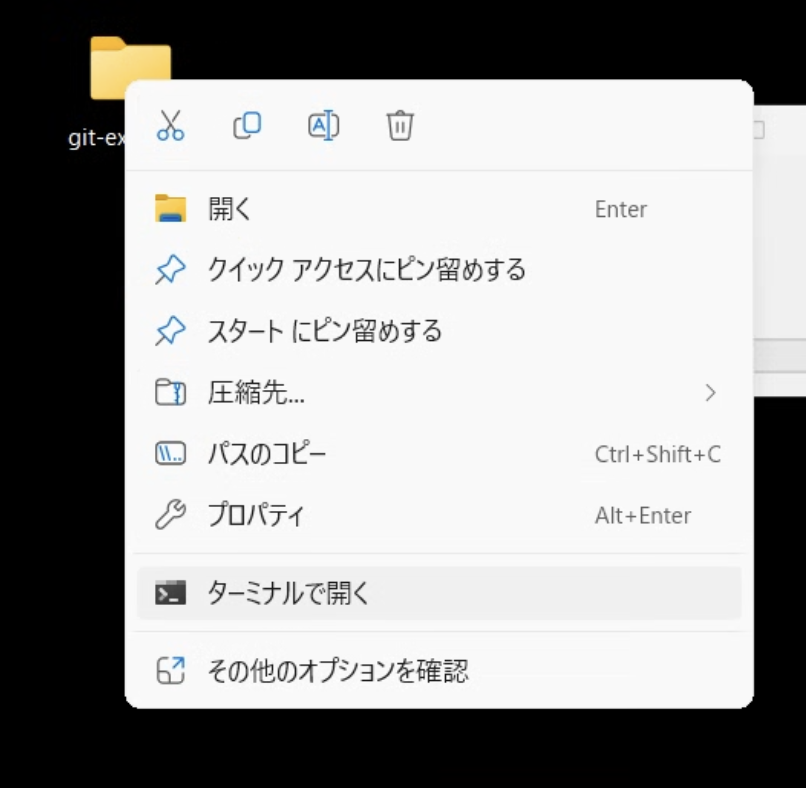

<script type="module">
import mermaid from 'https://cdn.jsdelivr.net/npm/mermaid@11.4.1/dist/mermaid.esm.min.mjs';
mermaid.initialize({ startOnLoad: true });
</script>


# 2時間目: コミットの解剖学 - 初めてのローカルリポジトリ

## Gitの基本ワークフローを理解し、Gitの内部構造と結びつける

---

## 学習目標

*   ローカルでの基本ワークフロー(init, add, commit)を実行する。
*   これらのコマンドと.gitディレクトリ内の物理的なファイル構造を結びつける。
*   Gitの初期設定の目的を理解する。

---

## このセッションで学ぶこと

*   このセッションでは、前回の講義で学んだGitの概念モデルと、具体的な操作や結果を結びつけます。
*   `git commit`という「魔法」のような操作が、`.git/objects`ディレクトリにファイルを生み出すのを目の当たりにすることで、その仕組みが明らかになります。
*   コマンドとファイルシステムが直接的に関連していることを理解することで、Gitがブラックボックスではないことを実感できるでしょう。
*   多くのチュートリアルのように単に手順を教えるだけでなく、各コマンドの後に`.git`ディレクトリの中を「覗き見る」時間を設けることで、皆さんの理解を深められたらと思います。

---


## ディレクトリ(フォルダー)の作成とターミナル

適当な場所でディレクトリ(フォルダー)を作成し、ターミナルでそこを開きます。



もしこの操作が難しいと感じる人は、ターミナル上で直接ディレクトリを作って移動するのもありです。

```pwsh
PS> mkdir ~/git-demo # ホームディレクトリ(C:/Users/USERNAME)直下に作成
PS> cd ~/git-demo
```

---

## Gitの初期設定: 「誰が」

Gitを使い始める前に、まず「誰が」コミットを作成するのかを設定します。これは、皆さんの作業に対する「署名」のようなものです。やったことありますよね。
**ポイント**: これは認証のためではありません。作成するすべてのコミットオブジェクトに焼き付けられるメタデータ、つまり皆さんの仕事に対する「署名」です。

*   `git config --global user.name "Your Name"`
*   `git config --global user.email "yourname@example.com"`

タイミングはともかく、このコマンド操作は皆さん必ずやっています。

---

### おまけ: スコープ

Gitの設定には『スコープ』(可視範囲)があります。

- `--global`: ユーザー全体に適用される設定。すべてのリポジトリで有効。
- `--local`: 現在のリポジトリにのみ適用される設定。特定のプロジェクトに対して異なる設定を行いたい場合
- (`--system`: システム全体に適用される設定。通常は管理者権限が必要)

---

## リポジトリの初期化: 「どこで」

Gitでバージョン管理を始めるには、まずリポジトリを初期化する必要があります。これは「どこで」Gitの管理を始めるかを指定するものです。
既に練習用のディレクトリに入っているのであれば、以下の操作で行われます。

```pwsh
PS> git init
```

**ポイント**: このコマンドは、プロジェクトフォルダ内に`.git`という隠しディレクトリを作成します。このディレクトリがGitリポジトリ全体であり、完全な履歴とすべてのオブジェクトが含まれています。

----- 

## .gitディレクトリのガイドツアー

Gitの心臓部である`.git`ディレクトリの中身を見てみましょう。最初のコミットを行う前に、`Get-ChildItem .git`などのコマンドを使って探検してみるのも良いでしょう。

主要な構成要素:

*   `HEAD`: 現在地(どのブランチにいるか)を指すファイル。
*   `config`: この特定のリポジトリのローカル設定。
*   `objects/`: すべてのコンテンツのデータベース(最初は空)。
*   `refs/heads/`: ローカルブランチが格納される場所。

---
## 基本ワークフローの実践: 「どのように」 (1/2)

Gitの基本的なワークフローを実際に体験してみましょう。

1.  **簡単なファイルを作成**  
    ```pwsh
    PS> New-Item README.md -ItemType File                #どちらか
    PS> Set-Content -Path README.md -Value "My Project"  #実行すればOK
    ```
2.  **`git status`**  
    Gitの「ダッシュボード」として紹介します。3つのツリーの状態(ステージされていない変更、コミットされるべき変更、追跡されていないファイル)を教えてくれます。
3.  **`git add README.md`**  
    この瞬間のファイルのスナップショットを撮り、インデックス/ステージングエリアに配置する操作です。

---

## 基本ワークフローの実践: 「どのように」 (2/2)

4.  **再度`git status`**  
    ファイルが「コミットする変更」に移動したことを確認します。
5.  **`git commit -m "Initial commit"`**  
    このプロセスを説明します。Gitはコミットオブジェクトを作成し、それはインデックスの状態を表すツリーオブジェクトを指します。そして、現在のブランチポインタがこの新しいコミットを指すように更新されます。


---

## 演習: 最初のコミットと分解

*   **目的**: Gitオブジェクトが作成される瞬間を直接目撃する。
*   **手順**:
    1.  各受講者は、新しいフォルダで`init`、`add`、`commit`のシーケンスを実行します。
    2.  コミット後、`git log --oneline`を実行し、コミットの7文字のハッシュをコピーします。
    3.  `.git/objects`ディレクトリに移動します。ハッシュの最初の2文字がサブディレクトリ名、残りの38文字がその中のファイル名になっています。PowerShellで`Get-ChildItem .git/objects`などを実行して確認できます。
    4.  受講者は、自分のコミットに対応するオブジェクトファイルを物理的に見つけ出します。これにより、コミットがデータベース内の実体ファイルであるという「アハ体験」が得られます。

---

## Gitオブジェクトの解剖: コミットの裏側

`git commit`にてGitは「オブジェクト」を作成します。これらは`.git/objects`に保存されます。これらがGitの「データベース」です。

*   **Blobオブジェクト**
*   **Treeオブジェクト**
*   **Commitオブジェクト**

これらのオブジェクトはSHA-1ハッシュで命名されます。`.git/objects`ディレクトリに保存されます。
Gitはデータの完全性を保証します。効率的に変更を追跡できます。

---

## Blobオブジェクト

Blobオブジェクトは、Gitが追跡するファイルの内容そのものです。
- テキストや画像など、あらゆるファイルが対象です。
- 各ファイルの内容は、SHA-1ハッシュで識別されます。
- 内容が同じなら、同じオブジェクトを共有します。
- `git add`時に作成されます。
- これにより、Gitは重複データを効率的に管理します。
- このオブジェクトは、ハッシュの最初の2文字がディレクトリ名、残りがファイル名として`.git/objects`内に保存されます。
- Gitはファイルの内容を圧縮して保存します。

---

## Treeオブジェクト

Treeオブジェクトは、Gitのディレクトリ構造を表現します。

- ファイルとサブディレクトリのリストを保持します。
- 各ファイルはBlobオブジェクトへの参照を持ちます。
- サブディレクトリは、さらにTreeオブジェクトを参照します。
- Treeオブジェクトは、Gitの「スナップショット」を形成します

普通に見るディレクトリ構造のようなものですね。

---

## Commitオブジェクト

Commitオブジェクトは、Gitのバージョン管理の中心です。

- 各コミットは、特定のTreeオブジェクトを指します。
- コミットには、作者の情報、コミットメッセージ、親コミットへの参照が含まれます。
- これにより、Gitはコミット履歴を追跡し、ブランチやマージを管理します。
- Commitオブジェクトは、Gitの履歴を形成し、プロジェクトの進化を記録します。

---

## 演習: Gitオブジェクトの探索

*   **目的**: Gitのオブジェクトの構造を理解し、コミットがどのように保存されるかを確認する。
*   **手順**:
    1.  前のセッションで作成したリポジトリに
        `git log --oneline`を実行し、最新のコミットのハッシュをコピーします。
    2.  `.git/objects`ディレクトリに移動し、
        ハッシュの最初の2文字をサブディレクトリ名、残りの38文字をファイル名として探します。
    3.  見つけたオブジェクトファイルを開き、内容を確認します。
    4.  各オブジェクトの種類(Blob、Tree、Commit)を識別し、それぞれの役割を理解します。

---

## 実際にやってみる

※ 出てくる値はあくまで例です、必ず自分の値を使いましょう

```pwsh
PS> git log --oneline
05b2ca1 (HEAD -> main) Initial commit
PS> get-childitem .git/objects
PS> get-childitem .git/objects/05
```

---

## オブジェクトの種類を確認する

```pwsh
PS> git cat-file -t 05b2ca1 # オブジェクトの種類を表示(Type)
commit
PS> git cat-file -p 05b2ca1 # commitオブジェクトの内容を表示(Pretty)
tree f93e3a1a1525fb5b91020da86e44810c87a2d7bc
author SATO Daisuke <densuke+gmail@example.com> 1752784879 +0900
committer SATO Daisuke <densuke+gmail@example.com> 1752784879 +0900

Initial commit
```

f93e3a1a〜 がTreeであることがわかる

---

## treeがある!

```pwsh
PS> git cat-file -t f93e3a1a # オブジェクトの種類を表示
tree
PS> git cat-file -p f93e3a1a # treeオブジェクトの内容を表示
100644 blob e69de29bb2d1d6434b8b29ae775ad8c2e48c5391    README.md
```

e69de29〜 Blobであり、README.mdというファイル名があることがわかる。

---

## Blobを見てみる

```pwsh
PS> git cat-file -t e69de29 # オブジェクトの種類を表示
blob
PS> git cat-file -p e69de29 # Blobオブジェクトの内容(おそらく空)
PS> git cat-file -s e69de29 # Blobオブジェクトのサイズを表示
0
```

---

## ファイルを差し替えてみる

README.mdに何かを書いてからコミット

```pwsh
PS> Set-Content -Path README.md -Value "Hello, World!"
PS> git add README.md
PS> git commit -m "Add greeting to README"
PS> git log --oneline -1 # 最新コミットだけ(-1)表示
89cf2db (HEAD -> main) Add greeting to README
```

あとはわかるよね?

---

## さらなる追跡

```pwsh
PS> git cat-file -t 89cf2db
commit
PS> git cat-file -p 89cf2db
tree 42986d465a13fdda7fc0f28b0eefd0f002f31aa8
...(以下略)
PS> git cat-file -t 42986d46
100644 blob 8ab686eafeb1f44702738c8b0f24f2567c36da6d    README.md
PS> git cat-file -p 8ab686e
Hello, World!
PS> git cat-file -p e69de29 # 前に見たBlobは残ってます(空)
```

---

## 何がわかった?

* Gitはコミットされたファイルは全て保有している
    * 差分とかではなく、そのものを持っている
* Gitはコミットの履歴を追跡している
* Gitはコミットの内容をツリー構造で管理している
* コミットオブジェクト(commit)にはツリー情報を含んでいる

---

## 親コミット

```pwsh
PS> git log --oneline -1
89cf2db (HEAD -> main) Add greeting to README
PS> git cat-file -p 89cf2db
tree 42986d465a13fdda7fc0f28b0eefd0f002f31aa8
parent 05b2ca18d1c426faa6e21768e63d7b8ca27a4c80 <==== ここ!
...
```

このコミットの『親』が誰なのかはここで見ることができる。

---

## コミットは有向グラフ(DAG)

ここに帰ってこれた!

<pre class="mermaid">
gitGraph
commit id: "05b2ca1"
commit id: "89cf2db" tag: "HEAD" tag: "main"
</pre>

