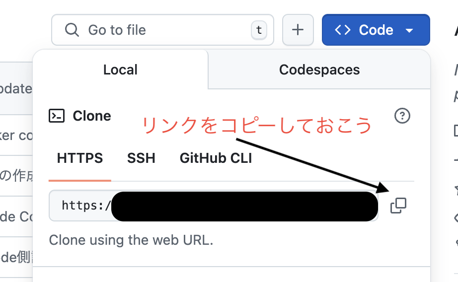

<script type="module">
import mermaid from 'https://cdn.jsdelivr.net/npm/mermaid@11.4.1/dist/mermaid.esm.min.mjs';
mermaid.initialize({ startOnLoad: true });
</script>

# 5時間目: リモートリポジトリと同期

## 共同作業のためのGitの基本

---

## 学習目標

*   リモートリポジトリの概念を理解します。
*   ローカルとリモート間の同期操作を習得します。

---

## このセッションで学ぶこと

*   リモートリポジトリの役割を学びます。
*   `git clone`でリポジトリを複製します。
*   `git remote`でリモートを管理します。
*   `git fetch`と`git pull`の違いを理解します。
*   `git push`で変更を共有します。
*   リモート追跡ブランチの役割を学びます。

---

## リモートリポジトリとは？

*   インターネット上やネットワーク上にあるGitリポジトリです。
*   チームメンバーとコードを共有するために使います。
*   通常はGitHub, GitLab, Bitbucketなどのサービスを利用します。
*   ローカルリポジトリの「コピー」であり、同期することで共同作業が可能です。

---

## 演習: リモートリポジトリの作成

リモートリポジトリ操作は今後の活動のためにも絶対必要となります。
ここで必ず自分で作ってみましょう。

1. https://github.com/ へ行く
2. 青い「New」ボタンををクリックし作成する、今回はpublicでよし
3. リポジトリのページに切り替わったらコードの取得をしておく



---


## リモートリポジトリの取得: `git clone`

-   既存のリモートリポジトリをローカルに複製します。
-   プロジェクトを開始する際の最も一般的な方法です。

試すには、適当な(リポジトリでない)ディレクトリを用意して、ターミナルで開いてください。

```pwsh
PS> git clone <リモートリポジトリのURL>
```

```pwsh
# 例
PS> git clone https://github.com/microsoft/markitdown.git
PS> cd markitdown # 〜.gitのベース名がディレクトリ名となります(変更可能)
```
※ これは実際の外部のリポジトリを使っています、必ず自分の取得したものを使って下さい。

---

## クローン後のディレクトリ構造

* `.git`: Gitの管理情報が格納されているディレクトリ。
  *   リモートリポジトリの情報や履歴が含まれています。
* その他のディレクトリは、リモートリポジトリの内容がそのままコピーされた状態です。
    * 初期化したばかりだと中身(コミットオブジェクト)はありません
* …って、**前の時間の話と同じではないですか?!**

---

## 『クローン』とは

* リモートリポジトリの内容をローカルに複製(clone)すること
* 実際に取得しているのは.gitディレクトリ以下の情報程度
  * 各種コミットオブジェクト(commit, tree, blob)やリモートの情報
* ワーキングディレクトリは、リモートの最新状態を反映
* コミットオブジェクトを取得後走査し、原初(ルート)のコミットから順に、ツリーを再構築
  * その結果、ワーキングディレクトリにファイルが展開される
* その一方で『リモート』が設定されます
---

## リモートの管理: `git remote`

*   リモートリポジトリの情報を管理します。
*   **リモートの一覧表示**: `git remote -v`
    *   設定されているリモートとそのURLを表示します。
        ```pwsh
        PS> git remote 
        origin
        PS> git remote -v
        origin	https://github.com/microsoft/markitdown.git (fetch)
        origin	https://github.com/microsoft/markitdown.git (push)
        ```
*   **リモートの追加**: `git remote add <名前> <URL>`
    *   例: `git remote add upstream https://github.com/original-user/original-repo.git`
    *   複数のリモートを設定できます。

---

## リモートの実用例

originを見れば、clone元やプロジェクトサイトがわかってしまう
```pwsh
PS> git remote -v
origin	https://github.com/microsoft/markitdown.git (fetch)
origin	https://github.com/microsoft/markitdown.git (push)
```

ブラウザで開いてみると、プロジェクトのページが表示されます
※ GitHubの場合はこうなりますが、他のリポジトリでは保証されません

---

## リモート追跡ブランチ

コミットオブジェクトには、リモート名を含むブランチが存在します。

*   `origin/main`のように、`リモート名/ブランチ名`の形式で表されます。
*   リモートリポジトリ上のブランチの状態をローカルに記録したものです。
*   最後にリモートと通信した時点でのリモートの状態を反映します。
*   ローカルのブランチとは独立しています。

<pre class="mermaid">
gitGraph
    commit id: "A"
    commit id: "B" tag: "main" tag: "origin/main"
    commit id: "C" tag: "main" tag: "origin/main"
</pre>

---

## 変更の取得: `git fetch`

*   リモートリポジトリから最新の変更をダウンロードします。
    * 実際に取得しているのはおおむねコミットオブジェクト達
*   **ローカルのブランチやワーキングディレクトリは変更しません。**
*   リモート追跡ブランチ（例: `origin/main`）を更新します。

```pwsh
PS> git fetch origin
# または git fetch # 全てのリモートからフェッチ
```

<pre class="mermaid">
gitGraph
    commit id: "A"
    commit id: "B" tag: "main"
    branch origin/main
    commit id: "C" 
    commit id: "D" tag: "origin/main"
</pre>
※ "main"のブランチが更新されていないところがポイント

---

## 変更の取り込み: `git pull`

*   `git fetch`と`git merge`を **組み合わせたショートカットコマンド** です。
*   リモートから変更をダウンロードし、現在のローカルブランチに統合します。
*   **現在のローカルブランチとワーキングディレクトリが更新されます。**
*   コンフリクトが発生する可能性があります。

```pwsh
PS> git pull
# または git pull origin main
```

<pre class="mermaid">
gitGraph
    commit id: "A"
    commit id: "B" 
    commit id: "C" tag: "main" tag: "origin/main"
</pre>

---

## 変更の共有: `git push`

*   ローカルリポジトリの変更をリモートリポジトリにアップロードします。
*   ローカルのコミットをリモートに反映させます。

```pwsh
PS> git push origin main
# または git push # 設定によってはリモートとブランチを省略可能
```

*   **注意点**: リモートにないコミットをプッシュしようとすると、拒否されることがあります。
    *   他の人が先にプッシュしている場合などです。
    *   その場合は、先に`git pull`でリモートの変更を取り込む必要があります。

---

## 演習: リモートとの並行操作

*   **目的**: 他の人がリモートリポジトリを操作嫉妬機の挙動を体験します。

*   **手順**:
    1.  `main`ブランチで変更を加えてコミットし、`git push`します。
    2.  ブラウザでリポジトリを表示し、ブラウザ上でリポジトリを操作してみます
    3.  そのままブラウザ上でコミットします。
    4.  最初の場所に戻り、`git fetch`と`git pull`の違いを体験します。
        *   `git fetch`後に`git log --oneline --graph --all`で履歴を確認します。
        *   `git pull`で変更を取り込みます。

---

## 演習: ローカルでのコミット(実演)

```pwsh
PS> new-item "example.txt" -Value "Hello, World!"
PS> git add example.txt
PS> git commit -m "Add example.txt"
PS> git push origin main
Enumerating objects: 3, done. # ここの「3」は一応覚えておいて!
Counting objects: 100% (3/3), done.
Writing objects: 100% (3/3), 233 bytes | 233.00 KiB/s, done.
Total 3 (delta 0), reused 0 (delta 0), pack-reused 0 (from 0)
To https://github.com/densuke/sample-git.git
 * [new branch]      main -> main
```
---

# 演習: ローカルでのコミット(ブランチイメージ)

<pre class="mermaid">
gitGraph
    commit id: "A" tag: "main" tag: "HEAD"
</pre>
↓ push後
<pre class="mermaid">
gitGraph
    commit id: "A" tag: "main" tag: "HEAD" tag: "origin/main"
    branch origin/main
</pre>

---

### 演習: リモートでの操作(演習)

ブラウザでリポジトリを開き、適当にファイルを作ります。

* GitHub上だと「+」のボタンでファイルを追加できます。
* 既存のファイルの編集も可能です。
* 処理後コミットメッセージを入れて(今回は適当)コミットしておきます

---

## 演習: リモートでの操作(ブランチイメージ)

(リモートの認識)
<pre class="mermaid">
gitGraph
    commit id: "A" tag: "main" tag: "HEAD" 
    branch origin/main
    checkout origin/main
    commit id: "B" tag: "origin/main"
</pre>
---

## 演習: リモートの変更を取り込む(fetch)

```pwsh
PS> git fetch origin # originは無くてもOK
remote: Enumerating objects: 7, done. <- 3→7になってる
remote: Counting objects: 100% (7/7), done.
remote: Compressing objects: 100% (4/4), done. <-足りない4つを取得
remote: Total 6 (delta 1), reused 0 (delta 0), pack-reused 0 (from 0)
Unpacking objects: 100% (6/6), 1.84 KiB | 269.00 KiB/s, done.
From https://github.com/densuke/sample-git
   3dfc7f7..8b262e1  main       -> origin/main
```

---

## 演習: リモートの変更を取り込む(ブランチイメージ)

<pre class="mermaid">
gitGraph
    commit id: "A" tag: "main" tag: "HEAD" 
    branch origin/main
    checkout origin/main
    commit id: "B" tag: "origin/main"
</pre>
- ローカルでもorigin/mainでのコミットオブジェクトは存在する
- ローカルのmainは現時点では動いていない
- 構造上「origin/main」が実際には一歩先行している状態

ローカル側でもこの認識になる

---

## 演習: リモートの変更を取り込む(merge)

```pwsh
PS> git merge origin/main
Updating 3dfc7f7..8b262e1
Fast-forward
 from-remote     | 1 +
 from-remote.txt | 1 +
 2 files changed, 2 insertions(+)
 create mode 100644 from-remote
 create mode 100644 from-remote.txt
```

ローカルで一切変更を加えずにリモートでいじった状態のため、FF(Fast-Forward)でマージされます。

---

## pullの実体

既に解説済みだったとは思いますが…

* `git pull`を実行すると、以下のことを行っています
    * `git fetch`でリモートの変更を取得
    * 取得したコミットの現ブランチにマージ可能なものが進んでいるかをチェック
        * ローカル取り込み分のorigin/mainがあるか、進んでいるか
    * 進んでいるのなら `git merge`を実行してマージ
* つまり、`git pull`は`git fetch`と`git merge`のショートカットみたいなもの

---

## マージ時の注意

* 必ずしもマージが成功するとは限りません
* コンフリクトの可能性はもちろんあります
  * 4限でやったように、このタイミングで発覚することがあります
* コンフリクトが発生したときは手動で解決する必要があります
  * コンフリクトしたところを確認し、コミットした人と協議しましょう
* マージコミットを作成してすすめましょう。

---

## まとめ

*   リモートリポジトリは共同作業の基盤です。
*   `git clone`でリモートリポジトリを複製します。
*   `git remote`でリモート情報を管理します。
*   `git fetch`はダウンロードのみ、`git pull`はダウンロードと統合です。
*   `git push`でローカルの変更をリモートに共有します。
*   リモート追跡ブランチはリモートの状態をローカルに記録します。
