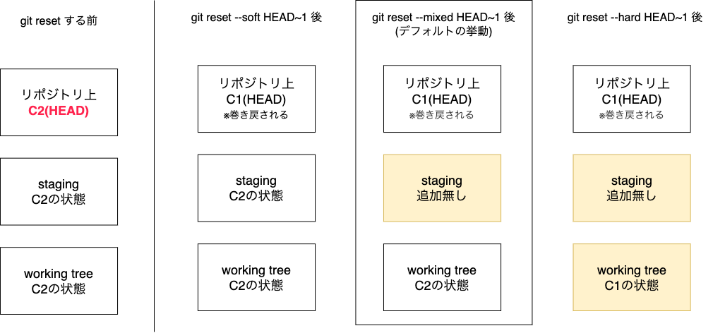

<script type="module">
import mermaid from 'https://cdn.jsdelivr.net/npm/mermaid@11.4.1/dist/mermaid.esm.min.mjs';
mermaid.initialize({ startOnLoad: true });
</script>

# 6時間目: 履歴の修正と取り消し

## やってしまった！を取り消す技術

---

## 学習目標

*   コミット履歴を修正・取り消す方法を学びます。
*   各コマンドの特性と注意点を理解します。
*   安全な方法と危険な方法を区別して使えるようにします。

---

## このセッションで学ぶこと

*   `git commit --amend`: 直前のコミットを修正します。
*   `git revert`: コミットを打ち消す新しいコミットを作成します。
*   `git reset`: 履歴を特定の地点まで巻き戻します。
*   `git reflog`: 操作履歴からコミットを復元します。

---

## なぜ履歴の修正が必要か？

*   コミットメッセージのタイポを直したい。 ← 地味にやる
*   ファイルを追加し忘れたので、コミットに含めたい。 ← あるある
*   間違った変更を安全に取り消したい。
*   ローカルでの実験的な変更を破棄したい。

**重要**: 一度共有した履歴の改変はとても危険です。
ルールを理解して、安全に操作しましょう。

---

## 直前のコミットを修正: `git commit --amend`

*   **目的**: 直前のコミットを「上書き」して修正します。
*   **用途**:
    *   コミットメッセージのタイポ修正。
    *   `add`し忘れたファイルをコミットに含める。
*   **注意**:
    *   実際は新しいコミットに置き換わります(IDが変わります)。
    *   リモートに`push`済みのコミットには絶対に使わないでください。
        * push前に行う分にはOK

---

## `amend` の使い方

```pwsh
# コミットメッセージだけを修正する場合
PS> git commit --amend -m "これが新しいメッセージです"

# ファイルの変更を追加して、メッセージはそのままの場合
PS> git add <追加・修正したファイル>
PS> git commit --amend --no-edit
```
`--no-edit`はメッセージを編集しない、というオプションです。

---

## 演習1: `amend`を使ってみる

1.  `amend-test.txt`というファイルを作成し、コミットします。
    *   メッセージは「[fix] add amend-test」のようにタイポを含めます。
2.  `git log`でコミット履歴を確認します。
3.  `git commit --amend -m "[fix] add amend-test.txt"`で修正します。
4.  再度`git log`を実行し、コミットIDが変わったことを確認します。

---

## 演習1: `amend`を使ってみる(操作)

```pwsh
PS> new-item amend-test.txt # 空のファイルを作成
PS> git add amend-test.txt; git commit -m "[fix] add amend-test"
PS> git log -1 # 最終コミットのコミットIDを確認 -- (a)
PS> git commit --amend -m "[fix] add amend-test.txt" # .txt抜けてた!
PS> git log -1 # 最終コミットのコミットIDを確認 -- (b)
```

(a)と(b)の違いを確認してください、コミットIDは別になっているはずです。

---

## 変更を打ち消す: `git revert`

*   **目的**: 過去のコミット内容を**安全に**打ち消します。
*   **仕組み**:
    *   指定したコミットの変更を**取り消す、新しいコミット**を作成します。
    *   既存の履歴は消さずに、その上に履歴を追加します。
*   **利点**:
    *   履歴が残るため、`push`済みのコミットにも安全に使えます。

`revert`は元コミットが存在している状態で、その状態を打ち消すコミットを作成します。

---

## `revert` の使い方

```pwsh
# 直前のコミット(HEAD)を打ち消す場合
PS> git revert HEAD

# 特定のコミットを打ち消す場合
PS> git revert <打ち消したいコミットのID>
```
コマンド実行後、打ち消しコミットのメッセージ編集画面が開きます。
そのまま保存すればOKです。

---

## 演習2: `revert`を使ってみる

1.  `revert-test.txt`に「最初の行」と書いてコミットします。
2.  同じファイルに「追加の行」を追記して、再度コミットします。
3.  `git revert HEAD`を実行し、直前のコミットを打ち消します。
4.  `git log`で打ち消しコミットが追加されたことを確認します。
5.  `revert-test.txt`の中身が「最初の行」だけに戻ったことを確認します。

---

## 演習2: `revert`を使ってみる(操作)

```pwsh
PS> new-item revert-test.txt -Value "最初の行"
PS> git add revert-test.txt; git commit -m "[etc] 最初の行"
PS> add-content revert-test.txt -Value "追加の行"
PS> git add revert-test.txt; git commit -m "[etc] 追加の行"
PS> git revert HEAD # 最終コミットはHEADで指しているのでそれを使用
PS> git log
PS> get-content revert-test.txt
```

---

## `revert`とコミット粒度に注意!

- revertは、指定したコミットの単位で『打ち消しコミット』を作成します
- 指定コミットでの変更が全て発生することになるので、途中のコミットを『打ち消した』場合、影響が出る可能性があります
- もしするなら、テスト用のブランチを作ってそこで試してから試す方が安全でしょう
- 予防策としてコミットは『1トピック1コミット』としておきましょう。
    - コミットにより『何が変わるのか』を明確にしておくこと
    - 変わることと関係ない変更をコミットに入れない強い意志が必要

---

## 履歴を巻き戻す: `git reset` (取扱注意)

*   **目的**: ブランチの先端を指定したコミットまで巻き戻します。
*   **危険なコマンド**:
    *   コミット履歴そのものを書き換えてしまいます。
    *   `push`済みのコミットに使うと、チームの履歴と矛盾が生じます。
    *   原則として、**ローカルでのみ使用**してください。

---

## `git reset` の3つのモード

`git reset`には、どこまで巻き戻すかに応じて3つのモードがあります。

*   `--soft`: コミットだけを巻き戻す。
*   `--mixed`: コミットと `add` を巻き戻す (基本はこれ)。
*   `--hard`: 全てを巻き戻す (ファイルも消える)。

---

## `reset` モードの図解(想定)

元の状態はこちら
<pre class="mermaid">
graph LR
    C1("C1") --> C2("C2")
</pre>
コミット2("C2")をどうするか、が今回のトピックです。

---

## `reset` モードの図解(soft/mixed/hard)




---

## `reset` の各状態の比較

* soft: コミットだけ巻き戻している
  * ステージングはそのまま
  * ワーキングツリーもそのまま
  * もう一度コミットすればC2が再現できる(コミットIDは別)
* mixed: コミットとステージングエリアを巻き戻している
    * ワーキングツリーはそのまま
    * ステージングエリアが空になる
    * もう一度**追加しなおしてから**コミットすればC2が再現できる(コミットIDは別)
* hard: コミット、ステージングエリア、ワーキングツリー全てを巻き戻している
    * つまり、C2の状態は完全に消える

---

## 相対的なコミット指定: `HEAD~`

コミットを指定する方法は、ハッシュIDだけではありません。
`HEAD`を基準に、相対的な位置で指定することもできます。

*   `HEAD`: 現在のコミット
*   `HEAD~` または `HEAD~1`: 1つ前のコミット
*   `HEAD~2`: 2つ前のコミット

このように `~` の後に数字を付けることで、何世代前のコミットかを指定できます。
これからの演習で使ってみましょう。

---

## `reset` を使ってみる(演習)

実際に2つのコミットを作成して試してみましょう。
まずは準備です。

1. 適当なディレクトリを用意して `git init`します。
2. `reset-test.txt`というファイルを作成し、1行目に「最初の行」と書いてコミットします。
3. 同じファイルに「追加の行」を追記して、再度コミットします。
4. `git log`で2つのコミットがあることを確認します。

---

## `reset` を使ってみる(操作)

```pwsh
PS> new-item reset-test.txt -Value "最初の行`n". # PowerShellでの行末改行は`n で記述します
PS> git add reset-test.txt; git commit -m "[etc] 最初の行"
PS> add-content reset-test.txt -Value "追加の行"
PS> git add reset-test.txt; git commit -m "[etc] 追加の行"
PS> git log --oneline --graph # 2つのコミットがあることを確認
```

---

## soft resetを試してみる

```pwsh
PS> git reset --soft HEAD~1
PS> git log --oneline --graph # 1つのコミットがあることを確認
PS> get-content reset-test.txt # ファイルの内容はそのまま
PS> git status # ステージングエリアに追加されていることを確認
```
確認できたら、再度コミットしておきましょう。

```pwsh
PS> git commit -m "[etc] 追加の行" # 再度コミット
PS> git log --oneline --graph # コミットが1つに戻ったことを確認
```

---

## mixed resetを試してみる(デフォルトの挙動)

```pwsh
PS> git reset HEAD~1 # 指定が無ければ --mixedです
PS> git log --oneline --graph
PS> git status # ステージにも上がっていない状態の出力になる
PS> git add reset-test.txt # 復帰のため再度追加して
PS> git commit -m "[etc] 追加の行"
```

---

## hard resetを試してみる

```pwsh
PS> git reset --hard HEAD~1
PS> git log --oneline --graph
PS> get-content reset-test.txt # 2行目が消えている
```

* hard resetは指定したところまでのコミットと変更が消滅します。
    * 下手にハードリセットするよりは、一度`revert`で戻すコミットを作成して様子見をした方が良いと思います。
      (`revert`の実験はブランチを切ってやると良いでしょう)
* 影響範囲が大きくなるため、必ずチームメンバーと相談してからにしましょう。

**⚠️ 重要**: `git reset --hard`は作業中の変更を完全に削除します。
実行前に必ず`git status`で状況を確認してください。

---

## 最後の砦: `git reflog`

*   **目的**: `HEAD`が移動した履歴（操作ログ）を確認します。
*   `reset --hard`で消してしまったように見えるコミットも、
    `reflog`には記録が残っています。
*   **使い方**:
    *   `git reflog`で操作履歴とコミットIDの一覧を表示します。
    *   戻りたい地点のコミットIDを見つけます。
    *   `git reset --hard <コミットID>`でその状態に復元します。

---

## `reflog`による復元シナリオ (説明のみ)

`reset --hard`は非常に危険な操作ですが、万が一間違えても`reflog`を知っていれば慌てる必要はありません。

**もし、先ほどの演習で`hard reset`をしてしまったら…**

1.  `git reflog` を実行すると、`reset`前のコミットIDが表示されます。
2.  `reset: moving to HEAD~1` のようなログが残っているはずです。
3.  その一つ前の、`commit`時のID（例: `abcdef1`）を見つけます。
4.  `git reset --hard abcdef1` を実行すれば、ワーキングツリーを含めて完全に元通りになります。

このように、`reflog`はローカルでの操作ミスに対する保険として機能します。

---

## 安全性の再確認

今回の講義で紹介したコマンドの安全性を再確認しましょう。

*   **安全 (共有リポジトリで使ってOK)**
    *   `git revert`
    *   理由: 履歴を上書きせず、新しいコミットとして追加するため。

*   **危険 (共有リポジトリでは原則NG)**
    *   `git commit --amend`
    *   `git reset`
    *   理由: 既存のコミット履歴を直接書き換える(消す)ため。

**黄金律: 一度リモートに`push`したコミットは書き換えるな。**

---

## まとめ

*   `--amend`: 直前のコミットをちょっと修正したい時に使います。
*   `revert`: 公開済みの間違いを安全に打ち消す時に使います。
*   `reset`: ローカルの間違いを根本からやり直す時に使います。
*   `reflog`: `reset`で失敗した時のためのタイムマシンです。
*   チームで作業する時は、履歴を書き換えない`revert`が基本です。
