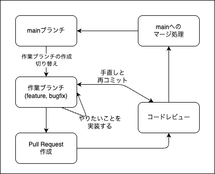
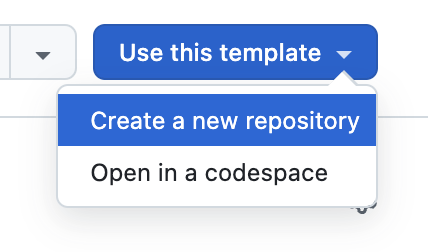

<script type="module">
import mermaid from 'https://cdn.jsdelivr.net/npm/mermaid@11.4.1/dist/mermaid.esm.min.mjs';
mermaid.initialize({ startOnLoad: true });
</script>

# 7時間目: GitHub Flowの体験

## 実践的なチーム開発ワークフロー

---

## 学習目標

*   これまでに学んだGitコマンドを統合します。
*   GitHub Flowに基づいた実践的な開発の流れを体験します。
*   個々のコマンドが実際の開発でどう連携するかを理解します。

---

## ワークフローモデル

ここで言うところの『ワークフロー』は、グループで開発を行うときに

- コードに対してどうコミットをして、
- どう共有するか

といった流れのことを主に扱っています。

---

## こういうのがあります

* 常に自分のコードを`main`(`origin/main`)にマージする
    * これは非常に危険ですが、実際の開発で地味に目にします
* [Git Flow](https://www.atlassian.com/ja/git/tutorials/comparing-workflows/gitflow-workflow):
  筆者的には悪くないと思っていますが、現状では非推奨となっていることが多い 
* [GitHub Flow](https://docs.github.com/ja/get-started/quickstart/github-flow):
  GitHub社が推奨している、シンプルで効果的なワークフロー
* [GitLab Flow](https://docs.gitlab.com/ee/topics/gitlab_flow.html): 
  GitLab社が推奨している、GitHub Flowをベースにしたワークフロー

他にもいろいろあるようですが、わかりやすいということもあり、GitHub Flowが広く使われています。
基本的な流れは次の図で確認しましょう。

---

## GitHub Flowとは?



1.  新しい作業は`main`から説明的な名前のブランチを作成して行う。
2.  ローカルでコミットし、定期的にリモートへ`push`する。
3.  フィードバックや助けが必要な時、または作業完了時にプルリクエストを作成する。
4.  レビューと承認を受けたら、`main`にマージする。
5.  マージ後、すぐに`main`をデプロイ（公開）する。

---

## ミニ演習: `README.md`を更新しよう

*   **シナリオ**: プロジェクトの`README.md`に、簡単な説明を追加する。
*   **ゴール**: GitHub Flowに沿って、安全に`main`ブランチを更新する。

これから、以下のステップを一緒に進めていきましょう。
1.  機能ブランチの作成
2.  ファイルの編集とコミット
3.  リモートへのプッシュ
4.  プルリクエストの作成
5.  プルリクエストのマージ
6.  ローカルの同期とクリーンアップ

---

### Step 0: リポジトリの準備




練習用リポジトリを作りました。

- [Awesome Repo](https://github.com/densuke/awesome-repo)
- `Use this template`ボタンを使い、自分のリポジトリ上で適当に作成してください
- clone用アドレスを取得して、ローカルでcloneしておきましょう

cloneした後、そのディレクトリを端末で開いて次へ進めます。

---

### Step 1: 機能ブランチの作成

まず、`main`ブランチが最新の状態であることを確認します。

```pwsh
PS> git switch main
PS> git pull origin main
```

次に、今回の作業専用のブランチを作成して、そちらに切り替えます。

```pwsh
PS> git switch -c update-readme
# Switched to a new branch 'update-readme'
```
ブランチ名は、何をするためのブランチか分かりやすい名前にしましょう。

※ なお別操作として `git checkout -b update-readme`でも同じことができます。現在は`git switch`と`git restore`が推奨されているので、そちらを使うことをお勧めします。

---

### Step 2: ファイルの編集とコミット

`README.md`ファイルを開き、何か説明を追記してみましょう。

```pwsh
# 例: README.mdを書き換える(VS Codeを呼び出して作業する)
PS> code --wait README.md
```

編集後、VS Codeを閉じると戻ってきます。
変更内容を確認し、コミットします。

```pwsh
PS> git status
PS> git add README.md
PS> git commit -m "[docs] READMEにプロジェクト説明を作成"
```

---

### Step 3: リモートへのプッシュ

作成したブランチとコミットは、まだローカルにしか存在しません。
プルリクエストを作るために、リモートリポジトリにプッシュします。

```pwsh
PS> git push -u origin update-readme
```
※   `-u` (または `--set-upstream`) を付けると、次回から`git push`だけでこのブランチにプッシュできるようになり、便利です。

---

### Step 4: プルリクエストの作成

1.  ブラウザでGitHubのリポジトリページを開きます。
2.  「`update-readme` had recent pushes」という通知が表示されているはずです。
3.  `Compare & pull request` ボタンをクリックします。
4.  変更のタイトルと、なぜこの変更が必要かの説明を記述します。
5.  `Create pull request` ボタンをクリックして作成完了です。

---

### Step 5: レビューとマージ

本来はここでチームメンバーがコードをレビューし、問題がなければ承認します。

*   **レビュー**: 変更内容にコメントを付けたり、修正を依頼したりします。
*   **承認**: 変更内容に問題がないことを示します。

今回はセルフレビューで、自分で自分のプルリクエストをマージしてみましょう。
プルリクエストのページで `Merge pull request` ボタンをクリックします。

---

### Step 6: 同期とクリーンアップ

`main`ブランチに変更が取り込まれたので、ローカルも最新の状態に更新します。

```pwsh
# 1. mainブランチに切り替え
PS> git switch main

# 2. リモートの最新状態を取得
PS> git pull origin main
```

最後に、不要になった機能ブランチを削除して、リポジトリを綺麗に保ちます。

```pwsh
# ローカルブランチの削除
PS> git branch -d update-readme

# リモートブランチの削除 (GitHubのPRマージ画面でも削除できます)
PS> git push origin --delete update-readme
```

---

## まとめ

GitHub Flowの流れを体験しました。

1.  **ブランチを切る**: `git switch -c <branch-name>`
2.  **開発する**: `add`, `commit`
3.  **プッシュする**: `git push origin <branch-name>`
4.  **プルリクエストを作る**: (GitHub上)
5.  **マージする**: (GitHub上)
6.  **片付ける**: `git pull`, `git branch -d`

この流れが、チーム開発における最も基本的で安全な進め方です。
